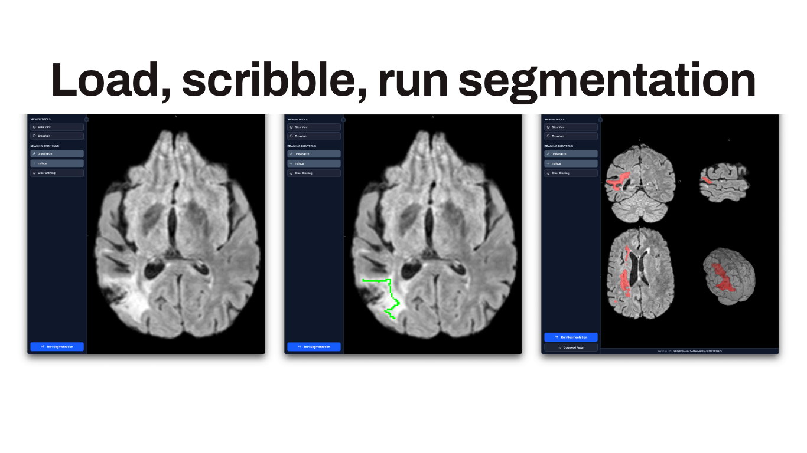

# niivue-nninteractive

An interactive segmentation application that combines [nnInteractive](https://github.com/MIC-DKFZ/nnInteractive) with [Niivue](https://niivue.com/).

## Getting Started



### Prerequisites

- [Pixi](https://pixi.sh/) for Python environment management
- [Bun](https://bun.com/docs/installation) for the frontend

### Clone the Repository

```bash
git clone git@github.com:hanayik/niivue-nninteractive.git
cd niivue-nninteractive
```

### Backend Setup (API)

1. Install dependencies using pixi:
```bash
pixi install
```

2. Start the development server:
```bash
pixi run dev
```

The API will be available at `http://localhost:8000`

### Frontend Setup (in a separate terminal)

1. Navigate to the frontend directory:
```bash
cd frontend
```

2. Install dependencies:
```bash
bun install
```

3. Start the development server:
```bash
bun run dev
```

The frontend will be available at `http://localhost:5173`

## Development

### Backend Commands

- `pixi run dev` - Start the API development server
- `pixi run test` - backend test suite

### Frontend Commands

- `bun run dev` - Start the development server
- `bun run build` - Build for production
- `bun run lint` - Run linting
- `bun run preview` - Preview production build